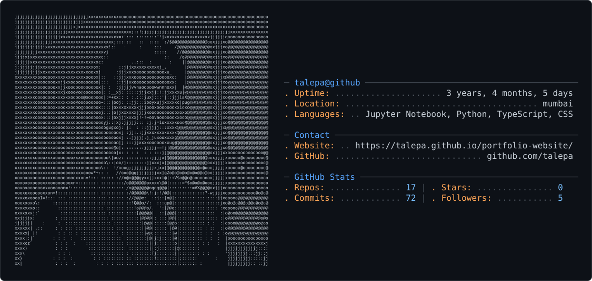

# 💫 About Me:
👋 Hey, I’m Rahul Talepa  I'm a Machine Learning Engineer & Data Enthusiast who loves building things that solve real problems. From predictive models to data stories to full-stack prototypes — I enjoy turning ideas into working systems.  🚀 What I Do  * 🤖 Build ML models (Regression, Classification, NLP, etc.) * 📊 Analyze and visualize data to extract meaningful insights * 🧠 Work with Python, scikit-learn, TensorFlow, Pandas, NumPy * 🛠️ Develop end-to-end solutions using Git, Docker, SQL, and APIs * ☁️ Exploring cloud + MLOps for scalable deployments  📚 Currently Learning  * 🧬 Deep Learning (CNNs, RNNs, LLMs) * ⚙️ MLOps practices (Docker, CI/CD, model deployment) * ☁️ Cloud services (AWS, GCP)   🤝 Let’s Connect  * 💼 [LinkedIn](https://www.linkedin.com/in/rahul-talepa/) * 🛠️ Always open to collaboration, ideas, and learning something new! 

## 🌐 Socials:
  

# 💻 Tech Stack:
                   
# 📊 GitHub Stats:
 
 

---

<picture>
  <source media="(prefers-color-scheme: dark)" srcset="dark_mode.svg" />
  <source media="(prefers-color-scheme: light)" srcset="light_mode.svg" />
  
</picture>
<!-- Proudly created with GPRM ( https://gprm.itsvg.in ) -->
